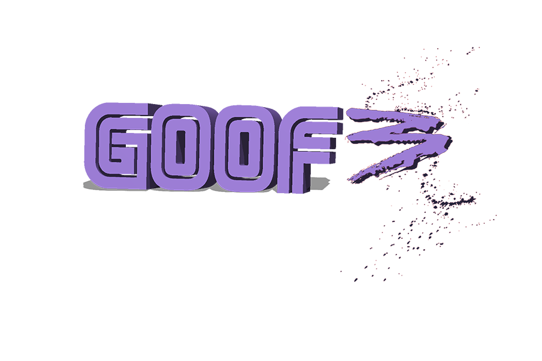

# Goof3



#### Blake Crowther, Nikky Rajavasireddy, Andrew Arteaga, Kevin Peters, Michael Simmons, Michael West

## Short Description

Have languages like Python made programming "too easy?" Well Goof3 is here to make it less easy! Goof3 is an improvement over the underappreciated and underdeveloped Goof2 language, which itself sought to improve upon its predecessor, Goof. Goof3 is the goofiest of programming languages. Parts of it make little to no sense, other parts of it make all of the sense possible. It is virtually impossible to sum up Goof3 in a mere sentence, but if one had to do so, Goof3 is the future of programming languages. It is all of the fun of JavaScript, but with all-around more goofiness.

## List of Features

- Declare variables with "goof".
- Declare functions with "phoof".
- True is now "toof" and false is now "foof".
- Declare print statements with "poof".
- Arrays begin at index 11.
- Static Typing, Static Scoping.
- Semicolons are colons, and colons are semicolons.
- Closure begins with "}" and ends with "{".
- Exceptions are thrown with witty and loosely-related error messages.
- Single-line comments must start with "XD".
- Multi-line comments must start with ";)" and end with "(;".
- Compare with an odd number of "=" signs, set values with an even number of "=" signs.
- Camel-case
- Use "not" instead of "!"
- High-order functions
- Declare while loops with "wooloop".

## Example Programs

Here are some examples, Goof3 on the left, JavaScript on the right.

### "Hello World" Example

- Declare print statements with "poof"

<table>
  <tr>
  <th>Goof3</th>
  <th>JavaScript</th>
  </tr>

  <tr>
  <td>

```
poof("hELlO woRlD!"):
```

  </td>

  <td>

```javascript
console.log('hELlO woRlD!')
```

  </td>

  </tr>
</table>

### Function Example

- Declare functions with "phoof".
- Use colon instead of semicolon.
- Reverse curly braces for closure.

<table>
  <tr>
  <th>Goof3</th>
  <th>JavaScript</th>
  </tr>

  <tr>
  <td>

```
phoof myFunction(p1, p2) }
  return p1 * p2:
{
```

  </td>

  <td>

```javascript
function myFunction(p1, p2) {
  return p1 * p2
}
```

  </td>

  </tr>
</table>

### Declaration Example

- Declare variables with "goof"
- No more doubles, longs, or floats
- Camel-case
- Set values with even number of "=" signs

<table>
  <tr>
  <th>Goof3</th>
  <th>JavaScript</th>
  </tr>

  <tr>
  <td>

```
goof letsGainThisGrain ==== 20.25:
```

  </td>

  <td>

```javascript
var money = 20.25
```

  </td>

  </tr>
  <tr>
  <td>

```
goof foot = }
  length; "1 Foot", 
  girth; "yes", 
  shoeSize; "12", 
  color; "white", 
  numberOfToes; "12 - 3"
{:
```

  </td>
  <td>

```js
var foot = {
  length: "1 Foot",
  girth: "yes", 
  shoeSize: "12", 
  color: "white", 
  numberOfToes: "12 - 3"
};
```
  </td>
  </tr>
</table>


### Comparison Example

- Compare values with odd number of "=" signs

<table>
  <tr>
  <th>Goof3</th>
  <th>JavaScript</th>
  </tr>

  <tr>
  <td>

```
gif ( 1 < 4 ===== toof) }
  return "troof":
{
```

  </td>

  <td>

```javascript
if (1 < 4 == true) {
  return "That's the truth"
}
```

  </td>

  </tr>
</table>

### Comment Example

- Single line comments must start with xD
- Multiline comments must start with ;) and end with (;

<table>
  <tr>
  <th>Goof3</th>
  <th>JavaScript</th>
  </tr>

  <tr>
  <td>

```
xD This is a single line comment in Goof3

;) This is a multiline
comment in Goof3 (;
```

  </td>

  <td>

```javascript
// This is a single line comment in JavaScript

/* This is a multiline
comment in javascript */
```

  </td>

  </tr>
</table>

### Throw Error Example

- Exceptions are thrown with witty and loosely-related error messages.

<table style="table-layout: fixed; width: 100%">
  <tr>
  <th>Goof3</th>
  <th>JavaScript</th>
  </tr>

  <tr>
  <td style="word-wrap: break-word;">

```
yeet "OOPSIE WOOPSIE!! Uwu We made a 
fucky wucky!! A wittle fucko boingo!
The code monkeys at our headquarters
are working VEWY HAWD to fix this!":
```

  </td>

  <td style="word-wrap: break-word;">

```js
throw `OOPSIE WOOPSIE!! Uwu We made a 
fucky wucky!! A wittle fucko boingo!
The code monkeys at our headquarters
are working VEWY HAWD to fix this!`;
```

  </td>

  </tr>
</table>

<!-- ### Class Example

- Classes are defined using the keyword *fourUnitClass*. The word *this* is replaced with *that* for instances references.

<table style="table-layout: fixed; width: 100%">
  <tr>
  <th>Goof3</th>
  <th>JavaScript</th>
  </tr>

  <tr>
  <td style="word-wrap: break-word;">

```
fourUnitClass Rectangle }
  constructor(hoof, woof) }
    that.hoof == hoof:
    that.woof == woof:
  {
{       
```

  </td>

  <td style="word-wrap: break-word;">

```js
class Rectangle {
  constructor(height, width) {
    this.height = height;
    this.width = width;
  }
}
```

  </td>

  </tr>
</table> -->

### Loop Example
- Declare for loops with "four".
- Declare while loops with "wooloop.
<table style="table-layout: fixed; width: 100%">
  <tr>
  <th>Goof3</th>
  <th>JavaScript</th>
  </tr>

  <tr>
  <td style="word-wrap: break-word;">

```
four (goof i == 7: i <  size: i++) }
    goof cat == -10:
{
```
```
goof counter == 10
wooloop (counter > 0) } 
    counter--:
    poof(nOt dOnE yEt):
{
```
  </td>

  <td style="word-wrap: break-word;">

```js
for (var i = 7; i < size; i++) {
  var cat = -10;
}
```
```js
var counter = 0;
while (counter > 0) {
  counter--;
  print(nOt dOnE yEt);    
}
```
  </td>

  </tr>
</table>

### Put it all together

```
phoof fib ( n) }
    gif (n <= 1) }
        return n:
    {
    xD hey there
    return fib (n - 2) + fib(n -1):
{

four (goof i ==== 11: i <  size - 11: i++) }
	goof dog == 10:
    ;) heres a
    multiline
    for you (;
    return "wHYyyYYyYy":
{
```
